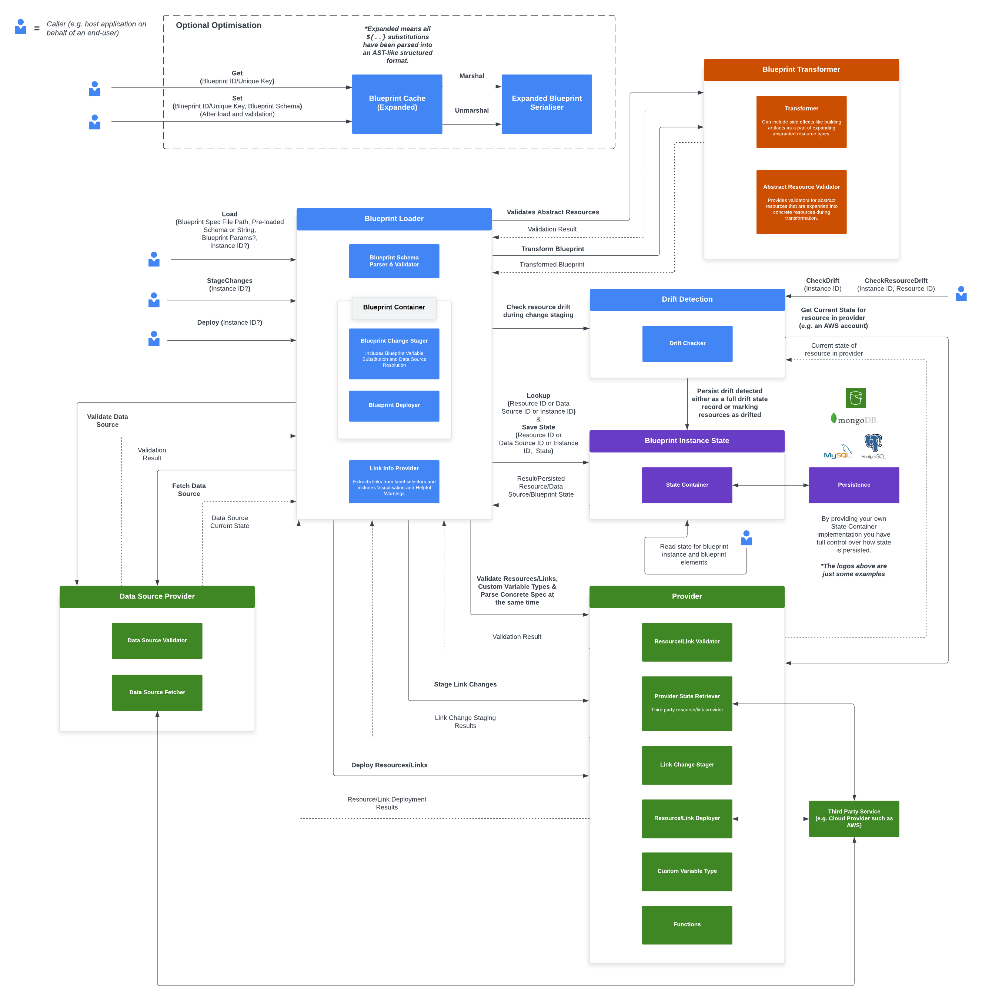

# blueprint framework

[](https://sonarcloud.io/summary/new_code?id=two-hundred_celerity-blueprint)
[](https://sonarcloud.io/summary/new_code?id=two-hundred_celerity-blueprint)
[](https://sonarcloud.io/summary/new_code?id=two-hundred_celerity-blueprint)

The blueprint framework is the foundation for Celerity application deployments that can be used as a standalone library for cloud and other resource deployment systems.

## Getting set up

### Prerequisites

- [Go](https://golang.org/dl/) >=1.20

Dependencies are managed with Go modules (go.mod) and will be installed automatically when you first
run tests.

If you want to install dependencies manually you can run:

```bash
go mod download
```

## Running tests

```bash
bash ./scripts/run-tests.sh

# to re-generate snapshots (For spec/schema tests)
bash scripts/run-tests.sh --update-snapshots
```

## Release tag format

Release tags for the common library should be created in the following format:

```
blueprint-MAJOR.MINOR.PATCH

e.g. blueprint-0.1.0
```

## Commit scope

**blueprint**

Example commit:

```bash
git commit -m 'fix(blueprint): correct cyclic dependency bug'
```

## Architecture



The blueprint framework provides a set of building blocks for creating systems
that can parse, validate and manage the lifecycle of blueprints.

A blueprint is a specification of resources the can be deployed to a downstream provider.
Providers are implemented on a per-namespace basis and there are no limitations around the type
of providers and resources that can be implemented in the model this library providers.

The mechanism is focused on parsing and validating blueprints along with managing the life cycle
of blueprint instances with interfaces for you to implement your own resource providers
and state containers.

This does not facilitate for persistence of blueprints themselves or any type of versioning/diff checking
on blueprint specifications. If your application needs this, you'll need to implement that layer within your application.

### Loader (container.Loader)

The loader deals with loading a spec from a file or a string, unmarshalling the JSON or YAML
and validating each resource in the spec with the configured resource providers.

This contains methods for loading a blueprint container that can be used to deploy
and stage changes for instances or simply validating a spec without loading a blueprint container for it.

A loader needs to be instantiated with a map of namespace -> resource providers and a state container.
An example of a namespace would be `aws/`.

The library comes with a default container loader that should meet all your needs.

### Blueprint Container (container.BlueprintContainer)

The blueprint container deals with deploying or staging changes for an instance of a blueprint spec.
It is a container for a single blueprint spec that talks to the resource provider to stage and deploy changes.
It also uses the resource provider to get the latest state of resources from the external system represented
by the provider.
The container also talks to the state container to load blueprint instances, save changes after deployments
along with retrieving state for instances and resources in those instances.

The blueprint container needs to be instantiated with a a state container, a map of resource names -> resource providers, a blueprint spec
and a spec link info provider.

The library comes with a default blueprint container that should meet all your needs.

### Spec Link Info Provider (links.SpecLinkInfo)

The link info provider deals with extracting links from a spec to build out a chain link whilst catching some potential issues
with links in a given spec.

The link extractor needs to be instantiated with a map of resource names -> resource providers and a blueprint spec.

The library comes with a default link info provider that should meet all your needs.

### Blueprint Spec (container.BlueprintSpec)

The blueprint spec deals with providing the schema of a blueprint, it's resources and the concrete spec generated
by the resource provider for each resource. A concrete spec is everything under the the `spec` mapping in the
YAML or JSON input blueprint.

The library comes with a default blueprint spec that should meet all your needs.

### State Container (state.Container)

A state container deals with persisting and loading state for blueprint instances, this could be to files on disk, to a NoSQL or relational database or a remote object/file storage service.

The library does NOT come with any state container implementations, you must implement them yourself.

### Resource Provider

A resource provider deals with validating, syncing state with the external software or system the provider represents, staging changes for approval
and deploying resources.

A resource provider is also responsible for implementing data sources that allows for dependencies between blueprints and sourcing data from external systems that have were deployed or created outside of the blueprint lifecycle.

_In the architecture diagram above, you will see the data source provider is a separate entity from the resource/link provider. This is purely like this to provide a clearer visualisation of the architecture and in code, data sources are a part of resource providers._

A resource provider can also provide custom variable types which are enum variable types with a fixed set of possible values; these are useful for a type of value with a large set of fixed possible values.

Finally, a resource provider is also responsible for implementing link implementations for links between resources.

In the case where there are links between resources that span multiple providers (e.g. AWS and Google Cloud), a resource provider needs to be implemented that represents the relationship between providers. In most cases this would be an abstraction that fulfils the provider interface that internally holds multiple providers. This will have it's own set of link implementations for resource types across providers.

The library does NOT come with any resource provider implementations, you must implement them yourself.
