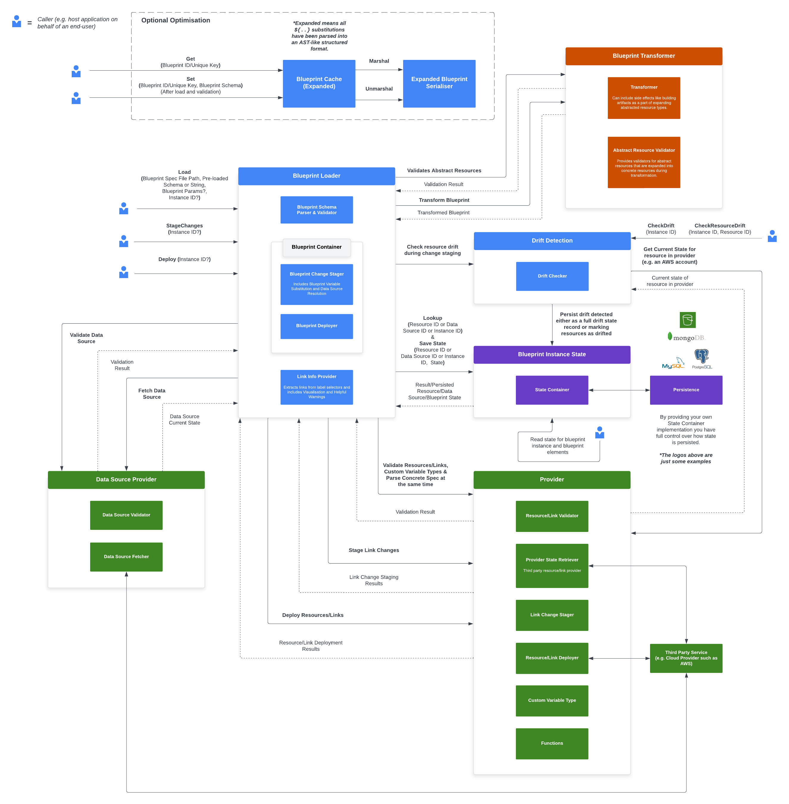

# Architecture



The blueprint framework provides a set of building blocks for creating systems
that can parse, validate and manage the lifecycle of blueprints.

A blueprint is a specification of resources the can be deployed to a upstream provider.
Providers are implemented on a per-namespace basis and there are no limitations around the type
of providers and resources that can be implemented in the model this library providers.

The blueprint specification can be found [here](https://www.bluelink.dev/docs/bluelink/blueprints/specification/).

The mechanism is focused on parsing and validating blueprints along with managing the life cycle
of blueprint instances with interfaces for you to implement your own resource providers
and state containers.

This does not facilitate the persistence of blueprints themselves or any type of versioning/diff checking
on blueprint specifications. If your application needs this, you'll need to implement that layer within your application or use a separate helper library.

The blueprint library does support caching blueprint specifications in their expanded form to make loading blueprints
that have been previously loaded without modifications more efficient.
This is significant as it allows skipping the need to parse each occurrence of a `${..}` substitution in the blueprint spec.

Authentication and authorisation is out of scope for this library and should be implemented by applications or helper libraries that extend the blueprint framework.

_The following sections are interfaces for the high level components of the blueprint framework, you can find deeper documentation about lower level components like "Resource" or "CustomVariableType" in the [go docs](https://pkg.go.dev/github.com/newstack-cloud/bluelink/libs/blueprint) and in the [Bluelink docs](https://www.bluelink.dev/docs/blueprint/intro)._

## Loader (container.Loader)

```go
type Loader interface {

    Load(
        ctx context.Context,
        blueprintSpecFile string,
        params bpcore.BlueprintParams,
    ) (BlueprintContainer, error)

    Validate(
        ctx context.Context,
        blueprintSpecFile string,
        params bpcore.BlueprintParams,
    ) (*ValidationResult, error)

    LoadString(
        ctx context.Context,
        blueprintSpec string,
        inputFormat schema.SpecFormat,
        params bpcore.BlueprintParams,
    ) (BlueprintContainer, error)

    ValidateString(
        ctx context.Context,
        blueprintSpec string,
        inputFormat schema.SpecFormat,
        params bpcore.BlueprintParams,
    ) (*ValidationResult, error)

    LoadFromSchema(
        ctx context.Context,
        blueprintSchema *schema.Blueprint,
        params bpcore.BlueprintParams,
    ) (BlueprintContainer, error)

    ValidateFromSchema(
        ctx context.Context,
        blueprintSchema *schema.Blueprint,
        params bpcore.BlueprintParams,
    ) (*ValidationResult, error)
}
```

The loader deals with loading a spec from a file, a pre-loaded schema or a string, unmarshalling the JSON or YAML
and validating each resource in the spec with the configured resource providers.

Pre-loaded schemas are useful for caching expanded blueprint schemas to make loading blueprints that have been previously loaded without modifications more efficient. You can implement the [BlueprintCache](#blueprintcache-cacheblueprintcache) interface to store and retrieve expanded blueprint schemas either side of loading a blueprint.

This contains methods for loading a blueprint container that can be used to deploy
and stage changes for instances or simply validating a spec without loading a blueprint container for it.

A loader needs to be instantiated with a map of namespace -> resource providers and a state container.
An example of a namespace would be `aws`.

The core framework comes with a default container loader that should meet all your needs.

## Blueprint Container (container.BlueprintContainer)

```go
type BlueprintContainer interface {

    StageChanges(
        ctx context.Context,
        input *StageChangesInput,
        channels *ChangeStagingChannels,
        paramOverrides core.BlueprintParams,
    ) error

    Deploy(
        ctx context.Context,
        input *DeployInput,
        channels *DeployChannels,
        paramOverrides core.BlueprintParams,
    ) error

    Destroy(
        ctx context.Context,
        input *DestroyInput,
        channels *DeployChannels,
        paramOverrides core.BlueprintParams,
    )

    SpecLinkInfo() links.SpecLinkInfo

    BlueprintSpec() speccore.BlueprintSpec

    Diagnostics() []*core.Diagnostic

    RefChainCollector() refgraph.RefChainCollector

    ResourceTemplates() map[string]string

    CheckReconciliation(
        ctx context.Context,
        input *CheckReconciliationInput,
        paramOverrides core.BlueprintParams,
    ) (*ReconciliationCheckResult, error)

    ApplyReconciliation(
        ctx context.Context,
        input *ApplyReconciliationInput,
        paramOverrides core.BlueprintParams,
    ) (*ApplyReconciliationResult, error)
}
```

The blueprint container deals with deploying or staging changes for an instance of a blueprint spec.
It is a container for a single blueprint spec that talks to the resource provider to stage and deploy changes.
It also uses the resource provider to get the latest state of resources from the external system represented
by the provider.
The container also talks to the state container to load blueprint instances, save changes after deployments
along with retrieving state for instances and resources in those instances.

The container also provides reconciliation capabilities for handling interrupted deployments and drift resolution.
`CheckReconciliation` fetches external state and compares it to persisted state to identify resources and links
needing attention, while `ApplyReconciliation` applies user-approved actions to update persisted state.

The blueprint container needs to be instantiated with a state container, a map of resource names -> resource providers, a blueprint spec
and a spec link info provider.

The core framework comes with a default blueprint container that should meet all your needs.

### Reconciliation Workflow

Reconciliation (handling interrupted deployments and drift) is performed as a **pre-flight check**
by the caller before invoking `StageChanges` or `Deploy`. The typical flow is:

1. Caller invokes `CheckReconciliation()` to detect interrupted resources or drift
2. If reconciliation is needed, caller presents results to user and collects decisions
3. Caller invokes `ApplyReconciliation()` with user-approved actions
4. Caller proceeds with `StageChanges()` / `Deploy()` / `Destroy()`

This separation allows the orchestration layer (e.g., Deploy Engine) to handle the interactive
reconciliation workflow while keeping Blueprint Core focused on staging and deployment logic.

Note: `StageChanges` and `Deploy` do not perform drift or reconciliation checks internally.
The caller is responsible for checking reconciliation state before calling these methods.

## Spec Link Info Provider (links.SpecLinkInfo)

```go
type SpecLinkInfo interface {

    Links(ctx context.Context) ([]*ChainLinkNode, error)

    Warnings(ctx context.Context) ([]string, error)
}
```

The link info provider deals with extracting links from a spec to build out a chain link whilst catching some potential issues
with links in a given spec.

The link extractor needs to be instantiated with a map of resource names -> resource providers and a blueprint spec.

The core blueprint framework comes with a default link info provider that should meet all your needs.

## Blueprint Spec (speccore.BlueprintSpec)

```go
type BlueprintSpec interface {

    ResourceSchema(resourceName string) *schema.Resource

    Schema() *schema.Blueprint
}
```

The blueprint spec deals with providing the schema of a blueprint, its resources and a `*core.MappingNode` representation of the resource specification. The resource specification is everything under the the `spec` mapping in the
YAML or JSON input blueprint. The spec must be a `*core.MappingNode` to allow for the usage of substitutions (with `${..}` syntax); a concrete, user-defined struct would not allow for this.

The core framework comes with a default blueprint spec that should meet all your needs.

## State Container (state.Container)

```go
type Container interface {

    Instances() InstancesContainer

    Resources() ResourcesContainer

    Links() LinksContainer

    Children() ChildrenContainer

    Metadata() MetadataContainer

    Exports() ExportsContainer
}

type InstancesContainer interface {

    Get(ctx context.Context, instanceID string) (InstanceState, error)

    LookupIDByName(ctx context.Context, instanceName string) (string, error)

    Save(ctx context.Context, instanceState InstanceState) error

    UpdateStatus(
        ctx context.Context,
        instanceID string,
        statusInfo InstanceStatusInfo,
    ) error

    Remove(ctx context.Context, instanceID string) (InstanceState, error)
}

type ResourcesContainer interface {

    Get(
        ctx context.Context,
        resourceID string,
    ) (ResourceState, error)

    GetByName(
        ctx context.Context,
        instanceID string,
        resourceName string,
    ) (ResourceState, error)

    Save(
        ctx context.Context,
        resourceState ResourceState,
    ) error

    UpdateStatus(
        ctx context.Context,
        resourceID string,
        statusInfo ResourceStatusInfo,
    ) error

    Remove(
        ctx context.Context,
        resourceID string,
    ) (ResourceState, error)

    GetDrift(
        ctx context.Context,
        resourceID string,
    ) (ResourceDriftState, error)

    SaveDrift(
        ctx context.Context,
        driftState ResourceDriftState,
    ) error

    RemoveDrift(
        ctx context.Context,
        resourceID string,
    ) (ResourceDriftState, error)
}

type LinksContainer interface {

    Get(
        ctx context.Context,
        linkID string,
    ) (LinkState, error)

    GetByName(
        ctx context.Context,
        instanceID string,
        linkName string,
    ) (LinkState, error)

    ListWithResourceDataMappings(
        ctx context.Context,
        instanceID string,
        resourceName string,
    ) ([]LinkState, error)

    Save(
        ctx context.Context,
        linkState LinkState,
    ) error

    UpdateStatus(
        ctx context.Context,
        linkID string,
        statusInfo LinkStatusInfo,
    ) error

    Remove(
        ctx context.Context,
        linkID string,
    ) (LinkState, error)

    GetDrift(
        ctx context.Context,
        linkID string,
    ) (LinkDriftState, error)

    SaveDrift(
        ctx context.Context,
        driftState LinkDriftState,
    ) error

    RemoveDrift(
        ctx context.Context,
        linkID string,
    ) (LinkDriftState, error)
}

type ChildrenContainer interface {

    Get(
        ctx context.Context,
        instanceID string,
        childName string,
    ) (InstanceState, error)

    Attach(
        ctx context.Context,
        parentInstanceID string,
        childInstanceID string,
        childName string,
    ) error

    SaveDependencies(
        ctx context.Context,
        instanceID string,
        childName string,
        dependencies *DependencyInfo,
    ) error

    Detach(ctx context.Context, instanceID string, childName string) error
}

type MetadataContainer interface {

    Get(ctx context.Context, instanceID string) (map[string]*core.MappingNode, error)

    Save(
        ctx context.Context,
        instanceID string,
        metadata map[string]*core.MappingNode,
    ) error

    Remove(ctx context.Context, instanceID string) (map[string]*core.MappingNode, error)
}

type ExportsContainer interface {

    GetAll(ctx context.Context, instanceID string) (map[string]*ExportState, error)

    Get(
        ctx context.Context,
        instanceId string,
        exportName string,
    ) (ExportState, error)

    SaveAll(
        ctx context.Context,
        instanceID string,
        exports map[string]*ExportState,
    ) error

    Save(
        ctx context.Context,
        instanceID string,
        exportName string,
        export ExportState,
    ) error

    RemoveAll(ctx context.Context, instanceID string) (map[string]*ExportState, error)

    Remove(
        ctx context.Context,
        instanceID string,
        exportName string,
    ) (ExportState, error)
}
```

A state container deals with persisting and loading state for blueprint instances, this could be to files on disk, to a NoSQL or relational database or a remote object/file storage service.

The core blueprint framework does NOT come with any state container implementations, you must implement them yourself or use a library that extends the blueprint framework.

## Provider (provider.Provider)

```go
type Provider interface {

    Namespace(ctx context.Context) (string, error)

    ConfigDefinition(ctx context.Context) (*core.ConfigDefinition, error)

    Resource(ctx context.Context, resourceType string) (Resource, error)

    DataSource(ctx context.Context, dataSourceType string) (DataSource, error)

    Link(ctx context.Context, resourceTypeA string, resourceTypeB string) (Link, error)

    CustomVariableType(ctx context.Context, customVariableType string) (CustomVariableType, error)

    Function(ctx context.Context, functionName string) (Function, error)

    ListResourceTypes(ctx context.Context) ([]string, error)

    ListLinkTypes(ctx context.Context) ([]string, error)

    ListDataSourceTypes(ctx context.Context) ([]string, error)

    ListCustomVariableTypes(ctx context.Context) ([]string, error)

    ListFunctions(ctx context.Context) ([]string, error)

    RetryPolicy(ctx context.Context) (*RetryPolicy, error)
}
```

A provider deals with validating resource definitions, deriving "live" state from the external software or system the provider represents, staging resource changes for approval
and deploying resources.

A provider is also responsible for implementing data sources that allows for dependencies between blueprints and sourcing data from external systems that have been deployed or created outside of the blueprint lifecycle.

_In the architecture diagram above, you will see the data source provider is a separate entity from the resource/link provider. This is purely like this to provide a clearer visualisation of the architecture and in code, data sources are a part of resource providers._

A provider can also provide custom variable types which are enum variable types with a fixed set of possible values; these are useful for a type of value with a large set of fixed possible values.

A provider can provide global pure functions that can be used in blueprint `${..}` substitutions.

Finally, a provider is also responsible for implementing link implementations for links between resources.

In the case where there are links between resources that span multiple providers (e.g. AWS and Google Cloud), a provider needs to be implemented that represents the relationship between providers. In most cases this would be an abstraction that fulfils the provider interface that internally holds multiple providers. This will have it's own set of link implementations for resource types across providers.

The interface for a provider includes `context.Context` and returns an `error` to allow for provider implementations over the network boundary like with an RPC-based plugin system.

The core framework does NOT come with any provider implementations, you must implement them yourself or use provider libraries that can be used to extend the blueprint framework.

## SpecTransformer (transformer.SpecTransformer)

```go
type SpecTransformer interface {

    GetTransformName(ctx context.Context) (string, error)

    ConfigDefinition(ctx context.Context) (*core.ConfigDefinition, error)

    Transform(
        ctx context.Context,
        input *SpecTransformerTransformInput,
    ) (*SpecTransformerTransformOutput, error)

    AbstractResource(ctx context.Context, resourceType string) (AbstractResource, error)

    ListAbstractResourceTypes(ctx context.Context) ([]string, error)
}
```

A spec transformer transforms a blueprint spec into an expanded form.
The primary purpose of a transformer is to allow users to define more concise specifications where a lot of detail can be abstracted away
during the blueprint development process and then expanded into a more detailed form for deployment.

The interface for a transformer includes `context.Context` and returns an `error` to allow for transformer implementations over the network boundary like with an RPC-based plugin system.

## AbstractResource (transformer.AbstractResource)

```go
type AbstractResource interface {

    CustomValidate(
        ctx context.Context,
        input *AbstractResourceValidateInput,
    ) (*AbstractResourceValidateOutput, error)

    GetSpecDefinition(
        ctx context.Context,
        input *AbstractResourceGetSpecDefinitionInput,
    ) (*AbstractResourceGetSpecDefinitionOutput, error)

    CanLinkTo(ctx context.Context, input *AbstractResourceCanLinkToInput) (*AbstractResourceCanLinkToOutput, error)

    IsCommonTerminal(
        ctx context.Context,
        input *AbstractResourceIsCommonTerminalInput,
    ) (*AbstractResourceIsCommonTerminalOutput, error)

    GetType(ctx context.Context, input *AbstractResourceGetTypeInput) (*AbstractResourceGetTypeOutput, error)

    GetTypeDescription(
        ctx context.Context,
        input *AbstractResourceGetTypeDescriptionInput,
    ) (*AbstractResourceGetTypeDescriptionOutput, error)
}
```

An abstract resource provides a way to validate a resource in an abstract (usually more concise) form before it is expanded into a more detailed form in the spec transformer implementation that the abstract resource belongs to.

## DriftChecker (drift.Checker)

```go
type Checker interface {

    CheckDrift(
        ctx context.Context,
        instanceID string,
        params core.BlueprintParams,
    ) (map[string]*state.ResourceDriftState, error)

    CheckDriftWithState(
        ctx context.Context,
        instanceState *state.InstanceState,
        params core.BlueprintParams,
    ) (map[string]*state.ResourceDriftState, error)

    CheckResourceDrift(
        ctx context.Context,
        instanceID string,
        instanceName string,
        resourceID string,
        params core.BlueprintParams,
    ) (*state.ResourceDriftState, error)

    CheckInterruptedResources(
        ctx context.Context,
        instanceID string,
        params core.BlueprintParams,
    ) ([]ReconcileResult, error)

    CheckInterruptedResourcesWithState(
        ctx context.Context,
        instanceState *state.InstanceState,
        params core.BlueprintParams,
    ) ([]ReconcileResult, error)

    CheckAllLinkDrift(
        ctx context.Context,
        instanceID string,
        params core.BlueprintParams,
    ) (map[string]*state.LinkDriftState, error)

    CheckLinkDrift(
        ctx context.Context,
        instanceID string,
        linkID string,
        params core.BlueprintParams,
    ) (*state.LinkDriftState, error)

    CheckAllLinkDriftWithState(
        ctx context.Context,
        instanceState *state.InstanceState,
        params core.BlueprintParams,
    ) (map[string]*state.LinkDriftState, error)

    ApplyReconciliation(
        ctx context.Context,
        results []ReconcileResult,
    ) error
}
```

A drift checker checks for drift between the state of a resource in the external system and the state of the resource in the blueprint state container.
Drift can be checked for a single resources or all resources in a blueprint instance.
As a part of the check, the drift checker will in most cases update the state of the resources being checked, storing the drift including a set of differences along with metadata attached to the resource about whether it is in sync or not.

The drift checker also provides reconciliation support for interrupted resources. `CheckInterruptedResources` detects resources left in an interrupted state (e.g., after a drain timeout) and determines their actual cloud state without updating persisted state. `ApplyReconciliation` then applies the reconciliation results to update persisted state after user approval.

The `WithState` variants (`CheckDriftWithState`, `CheckInterruptedResourcesWithState`, `CheckAllLinkDriftWithState`) accept pre-fetched instance state instead of an instance ID. These methods avoid redundant state fetches when the caller already has the instance state loaded, which is important for performance when the state container is backed by a relational database like PostgreSQL.

`CheckAllLinkDrift` and `CheckAllLinkDriftWithState` check for drift in all links within a blueprint instance, including intermediary resources managed by links.

A default drift checker is provided by the core blueprint framework that should meet all your needs.

## BlueprintCache (cache.BlueprintCache)

```go
type BlueprintCache interface {

    Get(
        ctx context.Context,
        key string,
    ) (*schema.Blueprint, error)

    Set(
        ctx context.Context,
        key string,
        blueprint *schema.Blueprint,
    ) error

    SetExpires(
        ctx context.Context,
        key string,
        blueprint *schema.Blueprint,
        expiresAfter time.Duration,
    ) error

    Delete(
        ctx context.Context,
        key string,
    ) error
}
```

The blueprint cache allows for the caching of expanded blueprint schemas to make loading blueprints that have been previously loaded without modifications more efficient.
For implementations that require a serialised form of the blueprint spec to store in a scalable cache, the `schema.Blueprint` struct can be serialised as a [Protocol Buffer](http://protobuf.dev/) using the built-in [ExpandedBlueprintSerialiser](#expandedblueprintserialiser-serialisationexpandedblueprintserialiser) and stored in the cache. _JSON and YAML serialisation can be used but will not store the blueprint in its expanded form so the primary benefits of caching will be lost. This is because the JSON and YAML serialisation will collapse `${..}` substitutions into strings and deserialisation will expand `${..}` substitutions._

The core framework does NOT come with any cache implementations, you must implement them yourself or use a library that extends the blueprint framework.

## ExpandedBlueprintSerialiser (serialisation.ExpandedBlueprintSerialiser)

```go
type ExpandedBlueprintSerialiser interface {

    Marshal(blueprint *schema.Blueprint) ([]byte, error)

    Unmarshal(data []byte) (*schema.Blueprint, error)
}
```

The expanded blueprint serialiser allows for the serialisation and deserialisation of expanded blueprint schemas, this is useful for storing expanded blueprint schemas in a cache or other storage mechanism.

The core framework comes with a single built-in expanded blueprint serialiser that uses [Protocol Buffers](http://protobuf.dev/) for serialisation and deserialisation. _The Protobuf serialisation format does not retain source code line and column information, so will not be particularly useful for reporting diagnostics for language servers or similar tools._ You can implement your own serialiser if you wish to use a different serialisation format.
